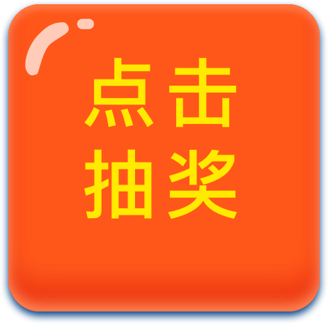

# luck-draw
#h5抽奖页面

12宫格

##动态图


###html布局
```
<div class="lotto" id="lotto">
    <table>
        <tr>
            <td class="awards award-0">
                
            </td>
            <td class="awards award-1">
                
            </td>
            <td class="awards award-2">
                
            </td>
            <td class="awards award-3">
                
            </td>
        </tr>
        <tr>
            <td class="awards award-11">
                
            </td>
            <!--中奖按钮-->
            <td class="awards" colspan="2" rowspan="2" id="lottoBtn">
                
            </td>
            <td class="awards award-4">
                
            </td>
        </tr>
        <tr>
            <td class="awards award-10">
                
            </td>
            <td class="awards award-5">
                
            </td>
        </tr>
        <tr>
            <td class="awards award-9">
                
            </td>
            <td class="awards award-8">
                
            </td>
            <td class="awards award-7">
                
            </td>
            <td class="awards award-6">
                
            </td>
        </tr>
    </table>
</div>
```
###调用JS
```
 $('#lottoBtn').on('click', function () {
//      调用插件
      $('#lotto').luckyDraw(
        {
          prize:5,//奖项从0-11，要选择要停留的位置，默认为0-11的随机数
//        speed:15,翻转速度，默认15，数值越大越慢，因为采用的是setTimeout
          callback: function () {
//            举例：中奖后弹出一个框出来
            $('#popUp').show();
          }//停留在奖项后的回调函数，完成后可以操作自己想要的内容，比如弹出框
        })
    })
 })   
```

#直接下载案例，更换图片即可使用
